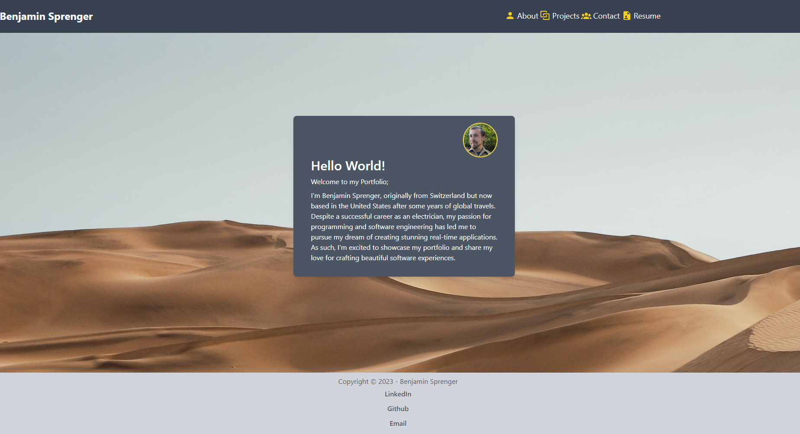

# portfoliosis
  

- [Installation](#installation)

- [Usage](#usage)

- [Contribution](#contributing)

- [License](#license)

## License

my personal portfolio!

## Installation

load up the website at [bencoded.dev](https://bencoded.dev)

## Usage

load it up!

## Contributing

please do not contribute

## Questions

Contact me!

Github: https://github.com/azrazel95

Email: beni.sprenger@hotmail.com

